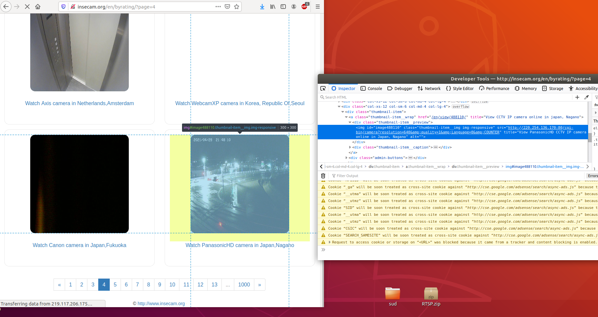

# Video acquisition from network IP camera
Perform acquisition from IP camera and creates a video for testing and/or video analysis.

## Requirements:
- python3.6+
    - cv2
- ffmpeg

You can install cv2 using pip or with apt-get if you are using ubuntu.

Tested on Ubuntu18.04 with python3.8.

## 1) Select a source

---

**Disclaimer**: I am **not** responsable of the incorrect usage of the stream data published on the "http://insecam.org/" website. Some data stream may has been published unintentionally, and the redistribution of the data may not be authorized. Beware that the data you acquire are treated in compliance with [GDPR](https://eur-lex.europa.eu/eli/reg/2016/679/oj) (if the acquired data is originated from the EU area), or in compliance with the privacy laws (if any) of the state of origin of the data.

---

For example look at "http://insecam.org/" and choose a camera.

If you don't know how to get the stream, use browser's developer tools to investigate on the camera and get the uri like the image below (the key is F12 usually, but check online for specific browser bindings).

## 2) Acquire

Launch the script `acquire.py` as the following:

`python3 acquire.py <http/rtsp/file/uri>`

Beware the "&" character, because the terminal will interpretate it as "launch the command in background", so if the uri has an "&" remember to use quotes around the uri to prevent it.

Also, you can specify the max running time with `--hours`. See `python3 acquire.py -h` for a complete list of settings.

At the end a video should be created. Otherwise see step 3.

## 3) Create a video

With `python3 create_video.py <folder>` you can create a video of the acquisition. By default the video has 1 frame for second, tweak the `--speed` parameter to get a good result.

See `python3 create_video.py -h` for the settings. Especially if you used some custom setting in `acquire.py`.
